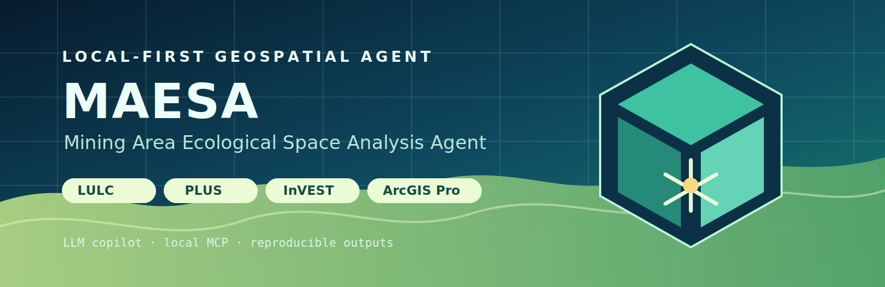
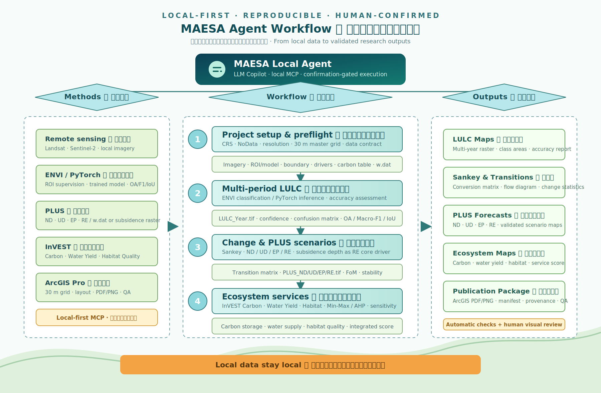

<p align="center">
  
</p>

<p align="center">
  <strong>Local-first LLM agent for mining-area ecological space analysis</strong>
</p>

<p align="center">
  <a href="#quick-start">Quick start</a> ·
  <a href="#workflow">Workflow</a> ·
  <a href="#llm-copilot">LLM Copilot</a> ·
  <a href="#local-software">Local software</a> ·
  <a href="#validation">Validation</a>
</p>

# MAESA Agent

**Mining Area Ecological Space Analysis Agent** turns a mining-area research workflow into a local, reproducible product. Provide local data and a `project.json`; MAESA validates the spatial contract, compiles a resumable workflow, calls installed desktop software locally, and records the outputs and evidence.

It is built for multi-period LULC, Sankey transitions, PLUS ND/UD/EP/RE scenarios, InVEST carbon and ecosystem services, subsidence-water carbon, ecological-service scoring, and ArcGIS Pro maps.

> **Local-first by design.** MCP, bridge processes and GIS software run on the same computer. Remote software control is rejected. A cloud LLM can be opted into for text planning, but never gains a remote route to ArcGIS Pro, ENVI, PLUS or InVEST.

## Workflow

<p align="center">
  
</p>

## What ships today

| Capability | Local implementation | Result state |
|---|---|---|
| Project builder, input validation, spatial preflight, manifests and resume | Python | Automatic |
| PyTorch semantic segmentation and registered ResNet-50 patch classification | Local PyTorch adapter | Patch-grid result stays `pending_validation` until independently assessed |
| ENVI supervised classification | Local IDL command bridge | Requires a licensed ENVI/IDL installation |
| LULC transitions, Sankey and standalone SVG maps | Python | Automatic |
| PLUS ND / UD / EP / RE | HPSCIL snapshot GUI bridge | pywinauto first; image-template fallback; first-use UI calibration required |
| InVEST Carbon | Local InVEST CLI | Automatic when LULC and carbon table are valid |
| Annual Water Yield / Habitat Quality | Local InVEST CLI and datastack contracts | Automatic when model parameters are supplied |
| Subsidence-water volume and composite carbon | ArcPy | DEM, water level and vertical datum required |
| Min-Max / AHP, trade-offs, sensitivity, comparison, GeoDetector | Python | Automatic |
| Publication layouts | ArcGIS Pro `compose_layout` | Adds declared stage outputs, checks renderer categories and exports preview/PDF/PNG |

`prepared`, `pending_validation` and `waiting_interactive` are intentional incomplete states; they are never reported as completed analysis.

## Quick start

### 1. Install as a Codex Skill

```powershell
npx skills add lancmd/MAESA-Agent -g
```

If Node.js is unavailable, install a supported Node.js runtime first, or use Codex Desktop's bundled runtime for the same command.

### 2. Set up the local runtime

```powershell
cd MAESA-Agent
.\scripts\setup_agent.ps1 -WithPyTorch -WithPlusGui
.\scripts\start_agent_mcp.ps1
```

The service listens only on `http://127.0.0.1:8765/mcp`. Point a compatible Agent client to [agents/openai.yaml](agents/openai.yaml), or let Codex invoke the Skill directly.

### 3. Create and run a project

```powershell
python .\scripts\project_validator.py --project .\project.json
python .\scripts\project_workflow.py --project .\project.json --run
```

The compiler generates `workspace/generated/workflow_job.json`; users do not maintain a separate job file. See [the input contract](docs/agent_input_contract.md) and [the synthetic demo](examples/huaibei_demo/README.md).

## LLM Copilot

MAESA is an **LLM-enabled agent product**, not a repository that trains model weights from scratch.

- When used from Codex, Claude, Qwen or another Agent client, the host Agent is the LLM; MAESA provides the domain workflow and local tools.
- For a standalone assistant, MAESA includes an optional Copilot adapter for a local Ollama model or an OpenAI-compatible endpoint.
- The Copilot creates a constrained JSON execution plan, shows its inputs/steps/outputs, and calls only allowlisted local MCP tools after `--confirm`.
- The local MCP service remains the only path to desktop GIS tools; an LLM never receives arbitrary shell-command authority.

```powershell
Copy-Item .\config\llm_provider.example.json .\config\llm_provider.json
python .\scripts\maesa_copilot.py --message "检查项目缺少哪些输入" --dry-run
```

Read [LLM Copilot](docs/llm_copilot.md) before enabling a cloud endpoint or downloading a local model. Choose a focused [task mode](docs/task_modes.md) when the project is not a full chain.

## Data handoff

Enable only the modules you need. The usual full chain needs:

- dated local imagery plus either ENVI ROI samples, a segmentation model package, or a registered ResNet-50 patch-classifier package;
- mine boundary, two or more LULC periods, and typed PLUS driver factors;
- carbon-density CSV;
- a positive-down subsidence-depth GeoTIFF **or** `w.dat` with its unit, convention, scope and maximum interpolation distance;
- Water Yield precipitation, ET0, soil layers, watershed and biophysical table;
- Habitat Quality threats, threat rasters and sensitivity table;
- optional ArcGIS Pro `.aprx`, layout and `.lyrx` files for publication maps.

The project fixes a 30 m projected analysis grid. Ten metre categorical LULC is aggregated by majority; continuous drivers use bilinear resampling; aspect uses nearest-neighbour treatment.

The registered ResNet-50 package is an RGB **image/patch classifier**, not a pixel-wise segmentation network. Its output is an explicit coarse patch grid that aggregates to the ordinary six-class scheme and remains `pending_validation`. See [the PyTorch model guide](deep_learning/pytorch_workflow.md) before using it in a project.

## Local software

Personal installations stay in ignored `config/local_paths.json` or environment variables. MAESA also discovers a standard ArcGIS Pro Windows registry installation, so a personal installation path is not committed to the repository.

| Software | Environment variable | Notes |
|---|---|---|
| ArcGIS Pro | `ARCGIS_PROPY`, `ARCGIS_PRO_EXE` | ArcPy processing and layout export |
| ENVI / IDL | `IDL_EXE` | Licensed ENVI headless classification |
| PLUS | `PLUS_V142_EXECUTABLE` | Local GUI bridge; calibration profile is ignored locally |
| InVEST | `INVEST_CLI` | Carbon, Water Yield, Habitat and optional models |

Run `python .\scripts\workflow_agent.py probe` to see what this computer can execute.

## Validation

Every project emits `outputs_manifest.json`, `provenance.json`, `validation_summary.json` and `agent_state.json`. The acceptance layer checks:

- LULC — OA, Macro-F1, Macro-IoU, class precision/recall/F1/IoU;
- PLUS — FoM, class accuracy and multi-seed stability;
- InVEST — independent-run consistency where available;
- ecosystem services — standardisation ranges, AHP consistency and sensitivity;
- maps — layers, renderer/category coverage, preview diagnostics, extent, resolution and a separate visual-review state.

Run the portable suite before publishing a change:

```powershell
python -m pytest .\tests\test_smoke_suite.py -q
python .\tests\mcp_smoke.py
```

The GitHub Actions workflow runs syntax checks, the contract suite and the MCP smoke test on Windows. Commercial desktop software is verified locally with small synthetic rasters, never in public CI.

## Project structure

```text
MAESA-Agent/
├── agents/                 # Agent-client connection definition
├── config/                 # templates; local paths and LLM config are ignored
├── docs/                   # input, software and Copilot contracts
├── mcp_server/             # local MCP service
├── scripts/                # workflow compiler and software bridges
├── plus_model/             # PLUS method contracts
├── invest_carbon/          # carbon and subsidence-water rules
├── ecosystem_service/      # service-model and evaluation rules
├── arcgis_steps/           # ArcGIS Pro processing and layout rules
├── envi_classification/    # ENVI classification rules
├── examples/huaibei_demo/  # anonymous synthetic demo
└── tests/                  # portable and local integration checks
```

## License and scope

MAESA-Agent 0.2.1 is released under the [MIT License](LICENSE). The license covers this repository's source code and documentation only. MAESA orchestrates installed software; it does not redistribute ArcGIS Pro, ENVI, PLUS or InVEST licenses, nor does it fabricate model inputs or scientific conclusions. Use independently validated data, documented coefficients and appropriate software licenses for research results.

### Optional real ResNet-50 integration test

The repository does not include research imagery or model weights. After installing the PyTorch runtime, set local paths through environment variables and run the opt-in test:

```powershell
$env:MAESA_RUN_REGISTERED_RESNET50 = "1"
$env:MAESA_RESNET50_MODEL_PACKAGE = "D:\models\lulc-resnet50"
$env:MAESA_RESNET50_TEST_RASTER = "D:\data\aligned_30m_rgb.tif"
.\.venv\Scripts\python.exe .\tests\registered_resnet50_real_inference.py
```

The test verifies the registered SHA-256 fingerprint, runs patch-grid inference, and checks the output class range. It does not treat the patch grid as independently validated pixel-wise LULC.

The tiny local InVEST water-yield and habitat-quality integration fixture is likewise opt-in: set `MAESA_RUN_LOCAL_INVEST_INTEGRATION=1` before running `tests/invest_ecosystem_integration_smoke.py`. This prevents a normal contract suite from launching a licensed desktop installation unexpectedly.

For a final workstation acceptance run after PLUS GUI calibration, set `MAESA_RUN_LOCAL_FULL_CHAIN=1` and `MAESA_LOCAL_FULL_CHAIN_PROJECT` to an approved local `project.json`, then run `tests/local_full_chain_regression.py`. It requires the workflow, final analysis validation, provenance, and output manifest to finish as `completed`.
